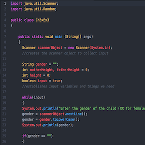
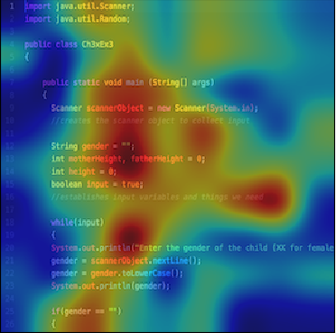
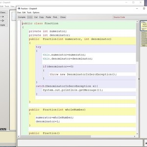
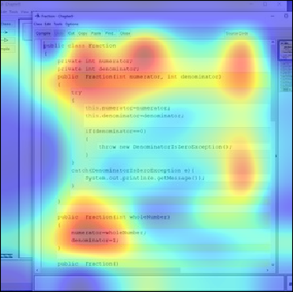
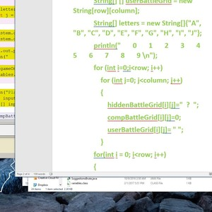
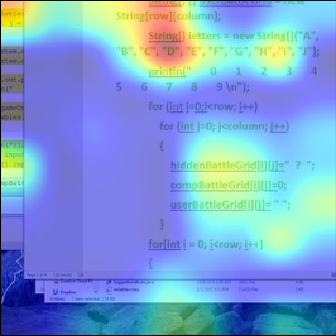
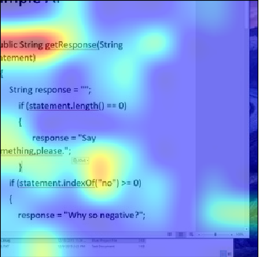

# Results
---
Below are the results for the models trained to identify Java typset and handwritten code in video frames.

Tagging                 |  Training Set              |  Testing Set
:-------------------------:|:-------------------------:|:-------------------------:
Code vs Partially Visible vs Handwritten vs No Code | C: 6,906, PVC: 1,109, HC: 314, NC: 7,030 | C: 1,734, PVC: 269, HC: 75, NC: 1,761
Handwritten Code vs Everything | HC: 314, E: 15,045 | HC: 75, E: 3,764
Code & Partially Visible Code vs No code | C: 8015, NC: 7030 | C: 2,003, NC: 1,761
Any type of code vs No code | C: 8,330, NC: 7,030 | C: 2,079, NC: 1,761
Only visible code vs No code | C: 6,906, NC: 7,030 | C: 1,734, NC: 1,761

 | Mean Accuracy | Median Accuracy
:-------------------------:|:-------------------------:|:-------------------------:
Only visible code vs No code | 92.917 | 92.725
Any type of code vs No code | 90.518 | 90.499
Code & Partially Visible Code vs No code | 90.323 | 90.182
Handwritten Code vs Everything | 98.609 | 98.646
Code vs Partially Visible vs Handwritten vs No Code | 85.594 | 85.547

## CAM Results ##
The [Images](Images/) directory contains CAM results on HTML, C, Python, and whiteboard writing. The Java results are shown below.

Test Image                 |  CAM Result
:-------------------------:|:-------------------------:
  |  
  |  
  |  
  |  
