# Results
---
### Fold 0 ###
java_python.h5, Train J/P/NC:4868/2490, Test J/P/NC:1199/652, ValAcc:98.76
java_python_no_code.h5, Train J/P/NC:4868/2490/5507, Test J/P/NC:1199/652/1359, ValAcc:92.34
java_python_pv_no_code.h5, Train J/P/NC:5687/2870/5507, Test J/P/NC:1411/744/1359, ValAcc:89.61

### Fold 1 ###
java_python.h5, Train J/P/NC:4845/2516, Test J/P/NC:1222/626, ValAcc:98.97
java_python_no_code.h5, Train J/P/NC:4845/2516/5511, Test J/P/NC:1222/626/1355, ValAcc:92.60
java_python_pv_no_code.h5, Train J/P/NC:5674/2889/5511, Test J/P/NC:1424/725/1355, ValAcc:90.01

### Fold 2 ###
java_python.h5, Train J/P/NC:4869/2512, Test J/P/NC:1198/630, ValAcc:98.74
java_python_no_code.h5, Train J/P/NC:4869/2512/5494, Test J/P/NC:1198/630/1372, ValAcc:92.66
java_python_pv_no_code.h5, Train J/P/NC:5688/2885/5494, Test J/P/NC:1410/729/1372, ValAcc:90.03

### Fold 3 ###
java_python.h5, Train J/P/NC:4834/2519, Test J/P/NC:1233/623, ValAcc:98.87
java_python_no_code.h5, Train J/P/NC:4834/2519/5479, Test J/P/NC:1233/623/1387, ValAcc:92.29
java_python_pv_no_code.h5, Train J/P/NC:5682/2904/5479, Test J/P/NC:1416/710/1387, ValAcc:89.81

### Fold 4 ###
java_python.h5, Train J/P/NC:4851/2532, Test J/P/NC:1216/610, ValAcc:98.41
java_python_no_code.h5, Train J/P/NC:4851/2532/5482, Test J/P/NC:1216/610/1384, ValAcc:92.62
java_python_pv_no_code.h5, Train J/P/NC:5681/2900/5482, Test J/P/NC:1417/714/1384, ValAcc: 89.67

## CAM Results ##

Test Image                 |  CAM Result
:-------------------------:|:-------------------------:
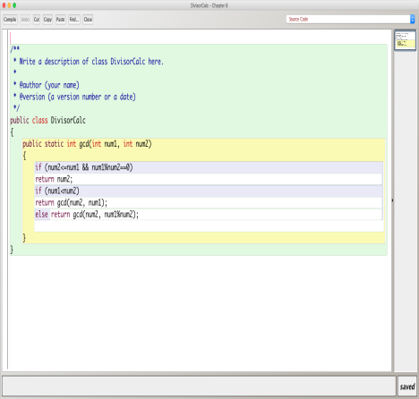  |  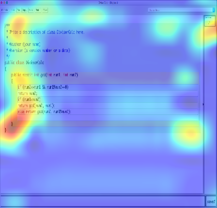
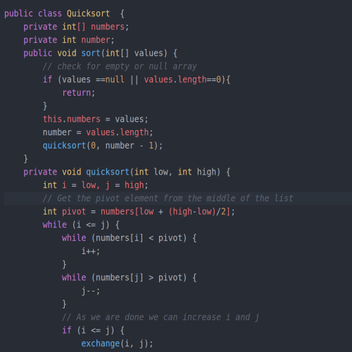  |  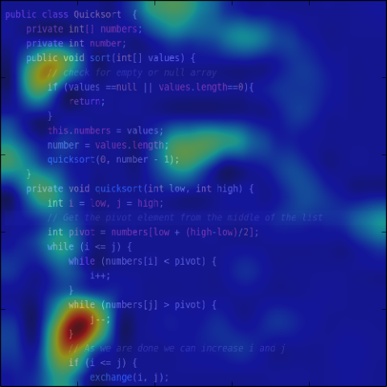
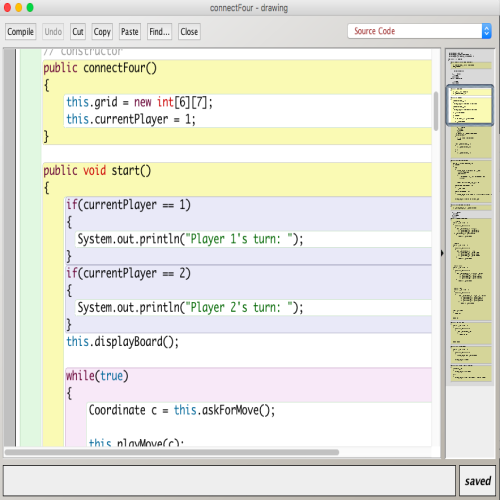  |  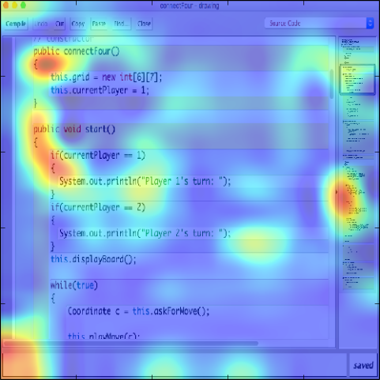
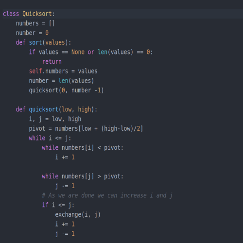  |  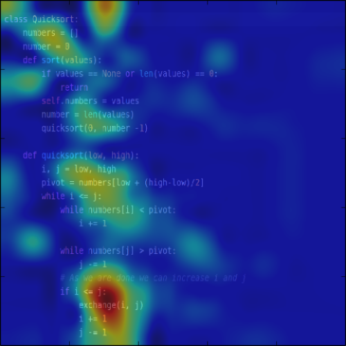
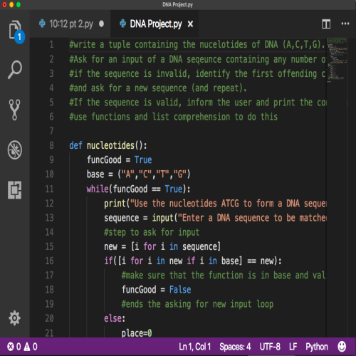  |  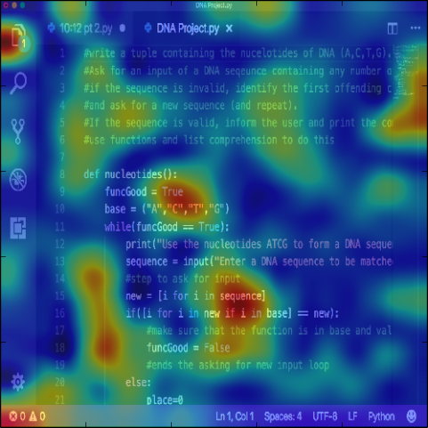
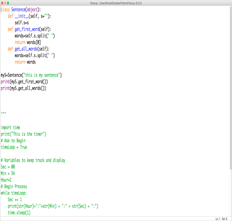  |  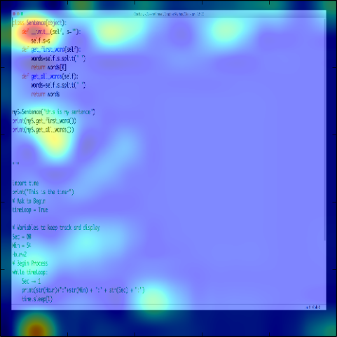
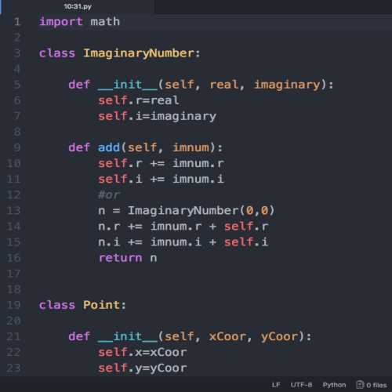  |  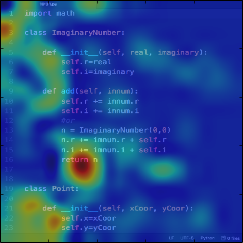
